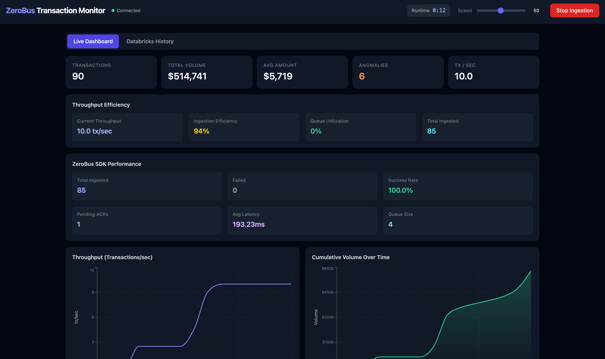
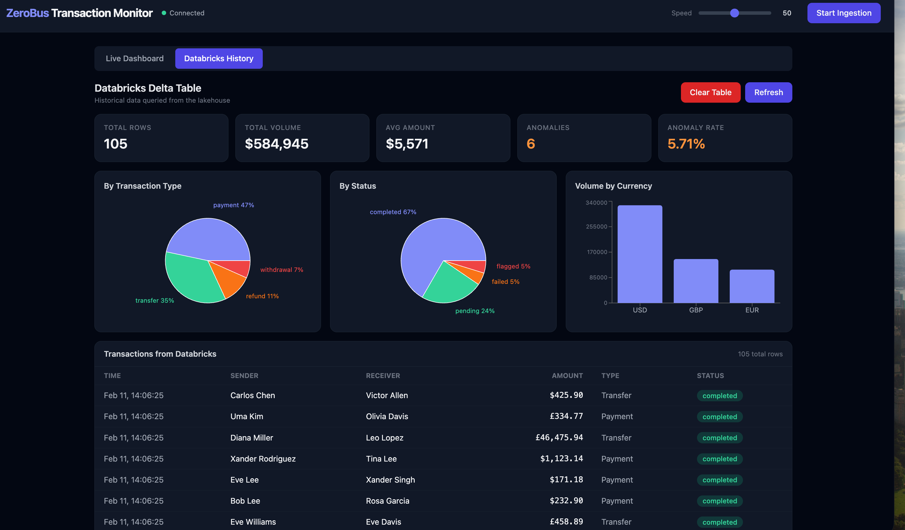

# ZeroBus Transaction Monitor

A high-performance real-time financial transactions dashboard that showcases the [ZeroBus Ingest SDK](https://github.com/databricks/zerobus-sdk-py) capabilities. The demo simulates transaction data, ingests it into Databricks Delta tables using async batch processing with parallel workers, and provides comprehensive performance visualizations.





## Key Features

### High-Performance Ingestion
- **Async batch processing** — Non-blocking ingestion with background ACK workers
- **Parallel workers** — Multiple concurrent ingestion workers for maximum throughput
- **Fire-and-forget architecture** — Generation continues while ingestion happens asynchronously
- **Queue-based buffering** — Handles high throughput without blocking

### Real-Time Performance Monitoring
- **Throughput metrics** — Real-time transactions/second tracking with exponential moving average
- **Latency percentiles** — P50, P95, P99 latency tracking for performance analysis
- **Generation vs Ingestion comparison** — Visual comparison showing async processing in action
- **Queue utilization** — Monitor ingestion queue health and backpressure
- **Success rate tracking** — Real-time ingestion success/failure metrics

### Comprehensive Dashboard
- **Live metrics** — Total transactions, volume, average amount, anomalies, and throughput
- **Performance visualizations** — Multiple charts showing throughput, volume, latency, and efficiency
- **Historical data view** — Query and visualize data stored in Databricks Delta tables
- **Runtime timer** — Track ingestion session duration
- **ZeroBus SDK metrics** — Detailed performance metrics from the ingestion SDK

## What it does

1. **Generates realistic financial transactions** — Random senders/receivers, amounts ($1–$50k), multiple currencies, and ~5% flagged as anomalous (high risk score)
2. **High-throughput ingestion** — Transactions are queued and ingested asynchronously using parallel workers, achieving 50-100+ tx/sec
3. **Real-time broadcasting** — Every transaction is pushed to connected browser clients via WebSocket
4. **Performance visualization** — Comprehensive dashboard with multiple charts showing throughput, latency, volume, and efficiency metrics
5. **Historical data querying** — Query aggregated statistics and paginated transaction history from Databricks using SQL Statement Execution API

## Architecture

```
┌─────────────────────────┐     WebSocket      ┌──────────────────────────┐
│   React + Vite + TS     │◄──────────────────►│   Python (FastAPI)        │
│   Tailwind CSS          │     REST API        │                          │
│   Recharts              │◄──────────────────►│   - Transaction generator │
│                         │                     │   - Async batch ingestion │
│  - Performance metrics  │                     │   - Parallel ACK workers │
│  - Throughput charts    │                     │   - WebSocket broadcast  │
│  - Latency percentiles  │                     │   - REST endpoints       │
│  - Historical queries   │                     │   - SQL query API        │
└─────────────────────────┘                     └──────────┬───────────────┘
                                                           │ gRPC (ZeroBus)
                                                           │ SQL API
                                                           ▼
                                                ┌──────────────────────────┐
                                                │  Databricks Delta Table  │
                                                │  (financial_transactions)│
                                                └──────────────────────────┘
```

## Quick start

```bash
# 1. Add your Databricks credentials
#    Create backend/.env with your values:
#    ZEROBUS_ENDPOINT=your-endpoint.zerobus.region.cloud.databricks.com
#    DATABRICKS_WORKSPACE_URL=https://your-workspace.cloud.databricks.com
#    DATABRICKS_CLIENT_ID=your-client-id
#    DATABRICKS_CLIENT_SECRET=your-client-secret
#    DATABRICKS_WAREHOUSE_ID=your-warehouse-id
#    DATABRICKS_TABLE=your-schema.your-table

# 2. Run everything
./start.sh
```

This installs dependencies, starts the backend on `:8000` and the frontend on `:5173`, and opens the dashboard. Press **Start Ingestion** in the browser to begin streaming.

`Ctrl+C` stops both servers.

> **See it in action:** Check out the screenshots above to see the live dashboard and historical data views!

## Manual setup

**Backend:**

```bash
cd backend
# Create .env file with your credentials (see Configuration section)
pip install -r requirements.txt
uvicorn main:app --reload
```

**Frontend (separate terminal):**

```bash
cd frontend
npm install
npm run dev
```

Open [http://localhost:5173](http://localhost:5173).

## Configuration

All credentials live in `backend/.env`:

| Variable | Description |
|---|---|
| `ZEROBUS_ENDPOINT` | ZeroBus server endpoint (e.g. `123456.zerobus.us-west-2.cloud.databricks.com`) |
| `DATABRICKS_WORKSPACE_URL` | Workspace URL (e.g. `https://dbc-xxxx.cloud.databricks.com`) |
| `DATABRICKS_CLIENT_ID` | Service principal application/client ID |
| `DATABRICKS_CLIENT_SECRET` | Service principal secret |
| `DATABRICKS_WAREHOUSE_ID` | SQL warehouse ID (required for historical data queries) |
| `DATABRICKS_TABLE` | Target Delta table (default: `main.default.financial_transactions`) |

### Optional Performance Tuning

You can tune ingestion performance via environment variables:

| Variable | Default | Description |
|---|---|---|
| `ZEROBUS_BATCH_SIZE` | 20 | Records per batch |
| `ZEROBUS_WORKERS` | 4 | Number of parallel ingestion workers |
| `ZEROBUS_MAX_QUEUE` | 2000 | Maximum queue size |
| `ZEROBUS_BATCH_TIMEOUT` | 0.1 | Batch timeout in seconds |

If credentials are missing or invalid, the app runs in **demo mode** — transactions still stream to the dashboard but are not ingested into Databricks. The historical data tab will show an error if `DATABRICKS_WAREHOUSE_ID` is not configured.

## Dashboard Features

The dashboard has two tabs:

### Live Dashboard Tab


**Summary Metrics:**
- Total transactions, volume, average amount, anomalies, and real-time tx/sec

**Performance Visualizations:**
- **Throughput Efficiency** — Current throughput, ingestion efficiency, queue utilization, and total ingested
- **ZeroBus SDK Metrics** — Total ingested, failed, success rate, pending ACKs, average latency, and queue size
- **Throughput Chart** — Real-time transactions/second over the last 60 seconds
- **Volume Chart** — Cumulative volume growth over time
- **Generation vs Ingestion** — Side-by-side comparison showing async processing
- **Transaction Rate** — Rate over time with 60-second rolling window
- **Latency Percentiles** — Min, P50, Avg, P95, P99, Max latency visualization

**Controls:**
- Runtime timer showing session duration
- Speed throttle (1-100) to control generation rate
- Start/Stop ingestion controls
- WebSocket connection status indicator

### Databricks History Tab


- **Summary statistics** — Aggregated metrics from the Delta table: total rows, volume, average amount, anomaly count/percentage, and time range
- **Breakdown charts** — Visualizations showing transaction distribution by type, status, and currency
- **Transaction table** — Paginated view of all historical transactions with sorting by timestamp
- **Refresh button** — Manually query the latest data from Databricks
- **Clear table** — Delete all rows from the Delta table (with confirmation)

## Performance Characteristics

The demo showcases ZeroBus SDK's high-performance capabilities:

- **Throughput**: 50-100+ transactions/second (limited by generation speed, not network latency)
- **Async processing**: Generation continues while ingestion happens in background
- **Low latency**: Average ACK latency typically < 200ms
- **Scalability**: Parallel workers handle high throughput efficiently
- **Reliability**: Queue-based buffering prevents data loss during spikes

## Tech Stack

| Layer | Technology |
|---|---|
| Frontend | React 18, Vite, TypeScript, Tailwind CSS, Recharts |
| Backend | Python, FastAPI, Uvicorn |
| Ingestion | databricks-zerobus-ingest-sdk (JSON mode, async batch processing) |
| SQL Queries | Databricks SQL Statement Execution API (httpx) |
| Real-time | WebSockets (FastAPI native) |
| Auth | OAuth2 service principal (client credentials) |

## Project Structure

```
zerobus-demo/
├── backend/
│   ├── main.py                  # FastAPI app — REST + WebSocket endpoints
│   ├── zerobus_client.py        # ZeroBus SDK wrapper with async batch processing
│   ├── databricks_sql.py        # Databricks SQL Statement Execution API client
│   ├── transaction_generator.py # Simulated transaction data
│   ├── models.py                # Pydantic models
│   ├── requirements.txt
│   └── .env                     # Your credentials (git-ignored)
├── frontend/
│   ├── src/
│   │   ├── App.tsx
│   │   ├── components/
│   │   │   ├── Header.tsx
│   │   │   ├── InsightsPanel.tsx
│   │   │   ├── ThroughputChart.tsx
│   │   │   ├── VolumeChart.tsx
│   │   │   ├── PerformanceComparison.tsx
│   │   │   ├── LatencyMetrics.tsx
│   │   │   ├── ThroughputEfficiency.tsx
│   │   │   ├── IngestionMetrics.tsx
│   │   │   ├── TransactionChart.tsx
│   │   │   ├── DatabricksTab.tsx
│   │   │   ├── HistoryCharts.tsx
│   │   │   ├── HistorySummaryCards.tsx
│   │   │   ├── HistoryTransactionTable.tsx
│   │   │   └── StatusBadge.tsx
│   │   ├── hooks/
│   │   │   ├── useWebSocket.ts
│   │   │   └── useDatabricksHistory.ts
│   │   └── types/
│   │       ├── transaction.ts
│   │       └── history.ts
│   ├── package.json
│   ├── vite.config.ts
│   └── tailwind.config.js
└── start.sh                     # One-command launcher
```

## API Endpoints

### Real-time Generation
- `POST /api/start` — Start transaction generation
- `POST /api/stop` — Stop transaction generation
- `GET /api/stats` — Get current generation statistics and ingestion metrics
- `POST /api/throttle?value=50` — Set generation speed (1-100)

### Historical Data
- `GET /api/history/summary` — Get aggregated statistics from Delta table
- `GET /api/history/transactions?limit=50&offset=0` — Get paginated transaction list
- `POST /api/history/clear` — Delete all rows from Delta table

### WebSocket
- `WS /ws` — Real-time transaction stream

## Performance Optimizations

The demo implements several optimizations to showcase ZeroBus SDK performance:

1. **Async batch ingestion** — Records are queued and processed in batches by parallel workers
2. **Non-blocking ACK handling** — ACKs are processed in background without blocking generation
3. **Exponential moving average** — Smooth rate calculations for better visualization
4. **Bounded data structures** — Limited buffer sizes prevent memory issues at high throughput
5. **Efficient chart rendering** — Charts use backend stats instead of processing all transactions

## Screenshots

### Live Dashboard
The live dashboard provides real-time performance monitoring with comprehensive visualizations:

- **Performance Metrics**: Track throughput, latency, and efficiency in real-time
- **Multiple Charts**: Throughput, volume, generation vs ingestion comparison, and latency percentiles
- **ZeroBus SDK Metrics**: Detailed ingestion performance including success rates and queue utilization

### Databricks History
Query and visualize historical data stored in Databricks:

- **Aggregated Statistics**: Summary metrics from the Delta table
- **Breakdown Charts**: Distribution by type, status, and currency
- **Transaction Table**: Paginated view with full transaction details

## License

This is a demonstration project showcasing ZeroBus SDK capabilities.
